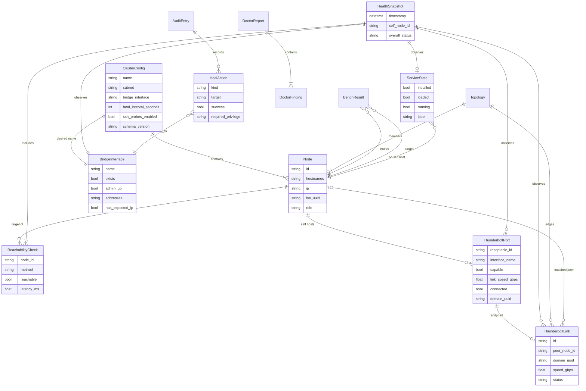
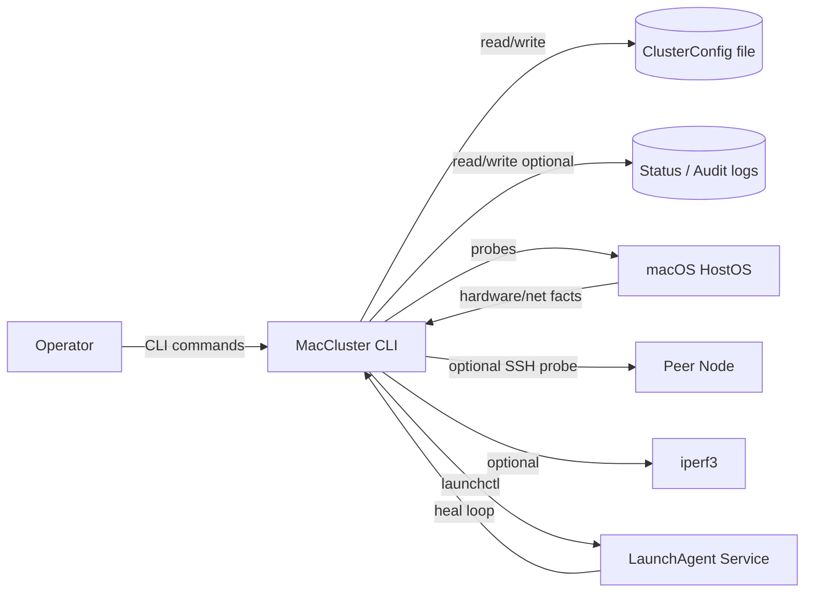
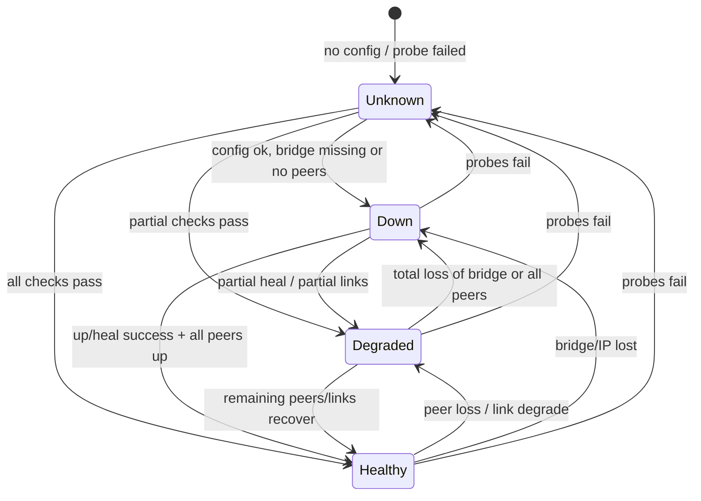
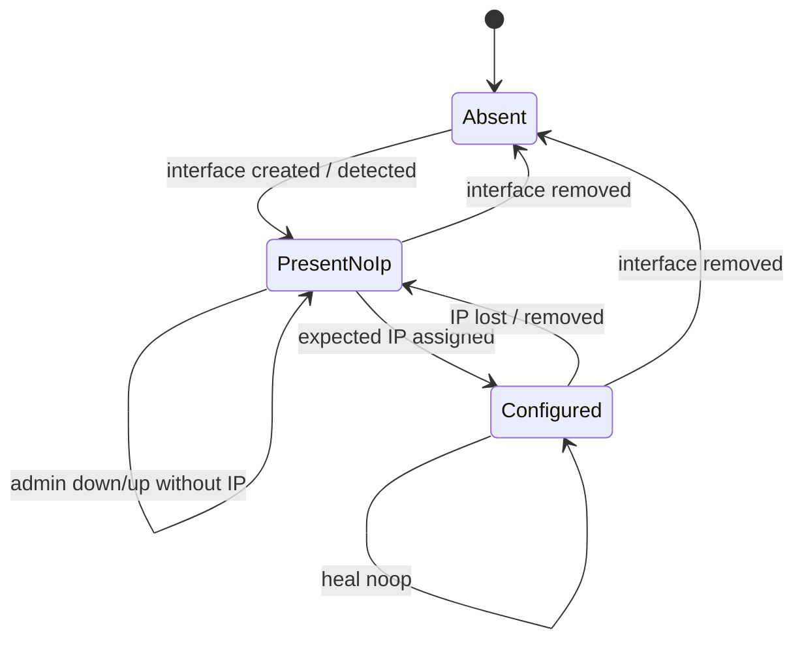
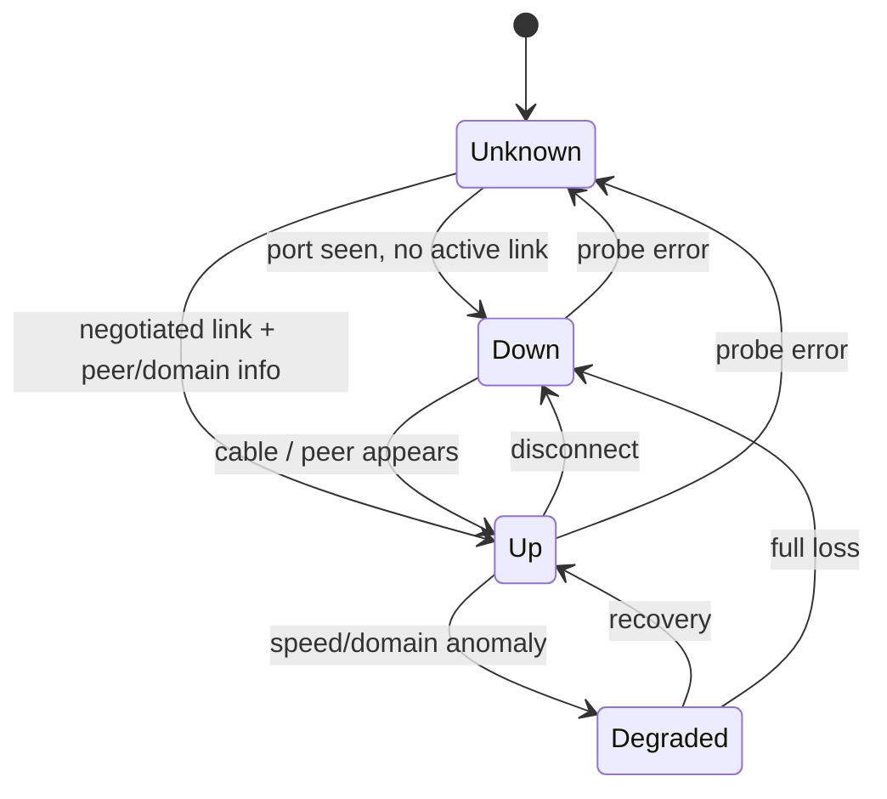
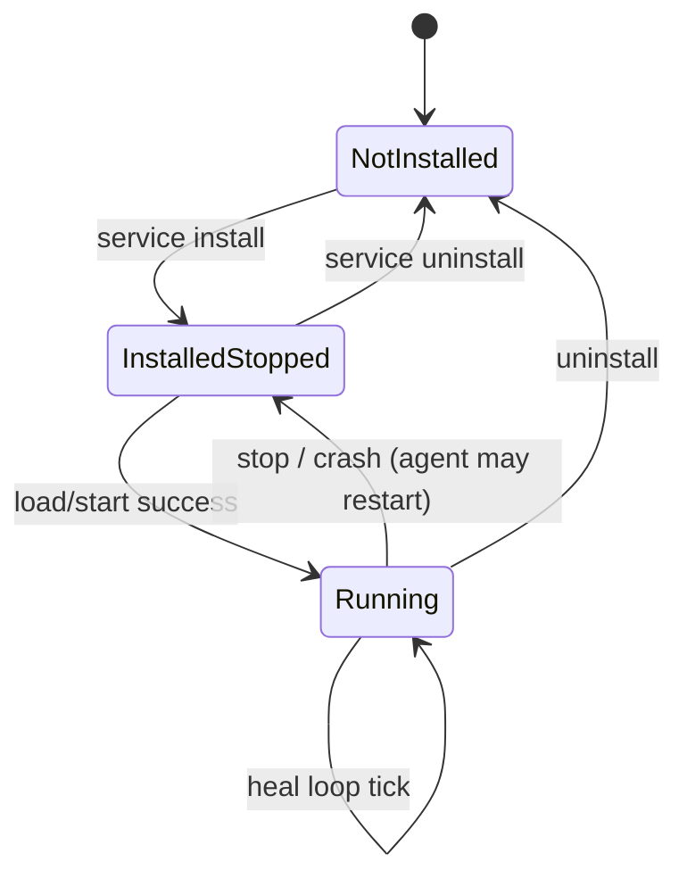
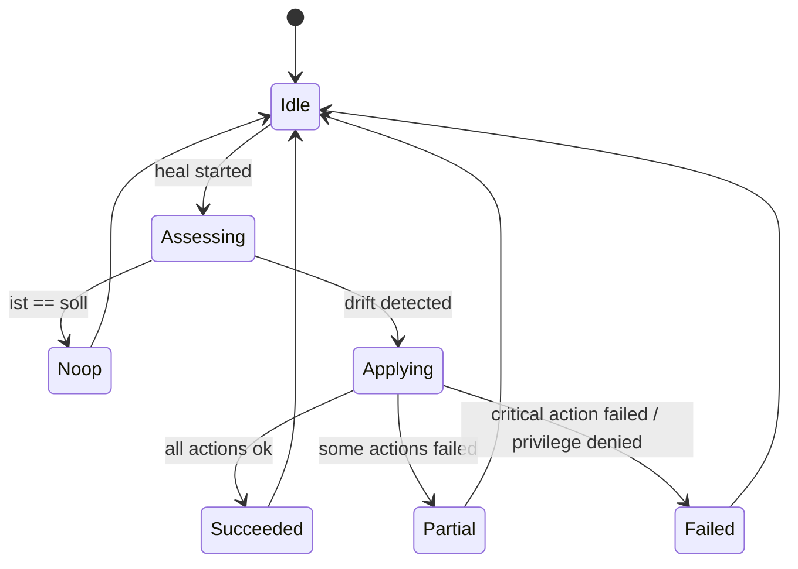
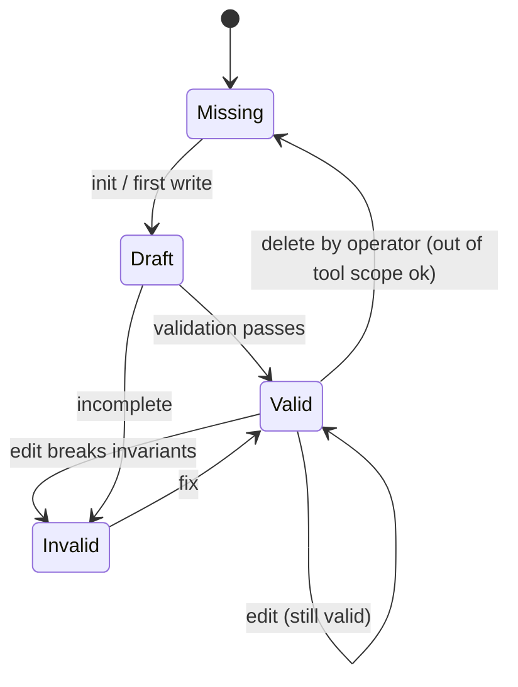
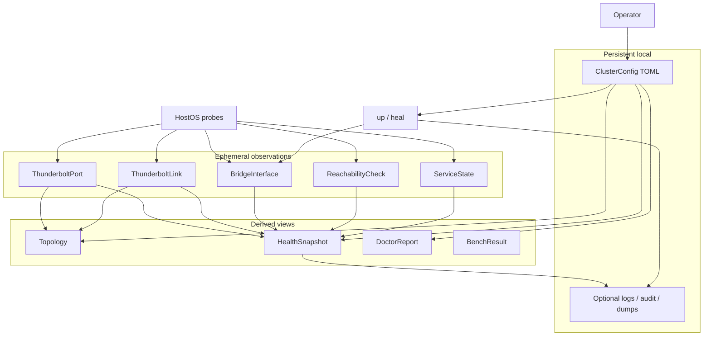

# Domänenmodell — MacCluster

| Feld | Wert |
|---|---|
| Projekt | MacCluster (`maccluster`) |
| Phase | 1 ANALYSE |
| Quelle | `_fabrik/00-intake/BRIEF.md` (2026-08-01) |
| Sprache Artefakt | Deutsch; Codebezeichner Englisch |

Dieses Dokument beschreibt die **Fachdomäne** unabhängig von Implementierungsdetails.
Es ist Eingabe für Architektur und Planung. Lösungsvorgaben (Dateipfade, Bibliotheken,
CLI-Flags) gehören nicht hierher, außer wo sie fachlich als Datenquelle benannt sind.

---

## 1. Domänengrenzen

### 1.1 In Scope

- Cluster aus **2–4** Apple Silicon Mac minis, dauerhaft per **Thunderbolt-/USB4-Kabel** verbunden
- Lokale **Cluster-Konfiguration** (Identität, feste TB-IPs, Subnetz, Interface)
- **Hardware-Erkennung** (Ports/Receptacles, Link-Geschwindigkeit, Peers, Domain-UUID)
- **Bring-up** der Thunderbolt-Bridge und fester IPs
- **Heal** (Wiederherstellung nach Drift/Reboot) und optionaler **Hintergrund-Service**
- **Live-Überwachung** (Status, Topologie, Erreichbarkeit, Diagnose, optional Bench)

### 1.2 Out of Scope (explizit)

- GUI / Web-UI / öffentliche HTTP-API / Cloud / Multi-Tenant
- Linux/Windows; andere Mac-Formfaktoren als Zielplattform v1
- Inference-/RDMA-Orchestrierung, zentrale DB, Multi-User-Login
- Automatische physische Kabelführungs-Empfehlung jenseits der Topologie-Darstellung

### 1.3 Akteure

| Akteur | Code | Beschreibung |
|---|---|---|
| Operator | `Operator` | Einzige Nutzerrolle; führt alle CLI-Aktionen unter dem lokalen macOS-Benutzer aus. Keine App-interne Authentifizierung. |
| Betriebssystem | `HostOS` | macOS liefert Hardware-, Netz- und Service-Fakten (Probes). |
| Peer-Node | `PeerNode` | Anderer Cluster-Member; optional per SSH erreichbar für Remote-Probes. |

---

## 2. Glossar

| Fachbegriff (DE) | Codebezeichner (EN) | Definition |
|---|---|---|
| Cluster | `Cluster` | Logische Gruppe von 2–4 Nodes mit gemeinsamer Config und TB-Mesh. |
| Cluster-Konfiguration | `ClusterConfig` | Persistente, operator-gepflegte Wahrheit über Name, Subnetz, Interface und Nodes. |
| Node / Member | `Node` | Ein Mac mini im Cluster; identifiziert über Hostname und/oder Hardware-UUID. |
| Eigen-Node | `SelfNode` | Der Node, auf dem der Prozess gerade läuft (`role = self`). |
| Peer | `Peer` | Anderer Node aus Sicht des Self-Nodes (`role = peer`). |
| Node-Identität | `NodeIdentity` | Fachliche Identität: stabiler `id`, Hostname(s), `hw_uuid`. |
| Feste TB-IP | `NodeAddress` | Vom Operator zugewiesene IPv4-Adresse im Cluster-Subnetz auf dem TB-Interface/Bridge. |
| Thunderbolt-Port | `ThunderboltPort` | Physischer Receptacle/Port am Mac mini mit Fähigkeit und zugehörigem Interface. |
| Thunderbolt-Link | `ThunderboltLink` | Verhandelte Verbindung zwischen zwei Ports (Speed, Domain, Peer-Zuordnung). |
| Domain-UUID | `domain_uuid` | OS-/TB-Domain-Kennung zur Mesh-/Kabel-Zuordnung. |
| Bridge-Interface | `BridgeInterface` | Logisches Netzwerk-Interface der Thunderbolt Bridge (Name, Status, Adressen). |
| Topologie | `Topology` | Abgeleitete Karte: welche Nodes über welche Links verbunden sind. |
| Erreichbarkeit | `Reachability` | Ergebnis eines Probes (z. B. Ping/SSH), ob ein Peer antwortet. |
| Gesundheits-Schnappschuss | `HealthSnapshot` | Zeitpunktbezogener Cluster-Zustand (Nodes, Links, Reachability). |
| Heal-Aktion | `HealAction` | Korrekturschritt (Bridge/IP/Interface), wenn Ist ≠ Soll. |
| Service-Zustand | `ServiceState` | Installations- und Laufzustand des optionalen LaunchAgent-Heal-Loops. |
| Diagnosebericht | `DoctorReport` | Aggregierte Prüfergebnisse (Config, Hardware, Netz, Service). |
| Bandbreiten-Messung | `BenchResult` | Optionaler iperf3-Lauf zwischen Nodes. |
| Audit-Eintrag | `AuditEntry` | Optionaler lokaler Append-Log-Eintrag für up/heal-Aktionen. |
| Probe | `Probe` | Lesezugriff auf OS- oder Peer-Fakten (system_profiler, ifconfig, ping, …). |

---

## 3. Entitäten

### 3.1 Übersicht

| # | Entität | Persistenz | Lebenszyklus |
|---|---|---|---|
| E1 | `ClusterConfig` | ja (Config-Datei) | manuell durch Operator |
| E2 | `Node` | ja (in Config) | mit Config |
| E3 | `ThunderboltPort` | nein (Live-Probe) | flüchtig je Probe |
| E4 | `ThunderboltLink` | nein (Live-Probe) | flüchtig je Probe |
| E5 | `BridgeInterface` | nein (Live; Soll in Config) | flüchtig / durch up/heal gesetzt |
| E6 | `Topology` | nein (abgeleitet) | flüchtig |
| E7 | `HealthSnapshot` | optional (Status-Dump/Log) | flüchtig oder kurz persistiert |
| E8 | `ReachabilityCheck` | nein (Teil von Snapshot) | flüchtig |
| E9 | `ServiceState` | ja (LaunchAgent-Fakten am Host) | install/uninstall/run |
| E10 | `HealAction` | optional (Audit) | Ereignis |
| E11 | `DoctorFinding` | nein (Ausgabe) | flüchtig |
| E12 | `BenchResult` | optional | flüchtig / Dump |
| E13 | `AuditEntry` | optional (Append-Log) | append-only |

---

### 3.2 ClusterConfig (`ClusterConfig`)

Persistente, operator-gepflegte **Soll-Wahrheit** des Clusters. Symmetrisch: dieselbe logische Config-Struktur auf jedem Member (lokale Kopie).

| Attribut | Typ | Pflicht | Beschreibung |
|---|---|---|---|
| `name` | string | ja | Menschlicher Cluster-Name |
| `subnet` | CIDR (IPv4) | ja | Cluster-Subnetz (Vorschlag laut Brief-OP: `10.42.0.0/24`) |
| `bridge_interface` | string | ja | Soll-Name des TB-Bridge-Interfaces |
| `nodes` | list[`Node`] | ja | 2–4 Nodes |
| `heal_interval_seconds` | int (>0) | nein | Heal-Zyklus; Default **30** (ANNAHME Brief #10) |
| `ssh_probes_enabled` | bool | nein | Ob Remote-SSH-Probes genutzt werden; Default **false/optional** (OP-3) |
| `schema_version` | string/int | ja | Config-Formatversion für spätere Kompatibilität |
| `created_at` | datetime | nein | Erzeugungszeitpunkt (init) |
| `updated_at` | datetime | nein | Letzte Änderung |

**Invarianten:**

- I-CC-1: `2 ≤ len(nodes) ≤ 4`
- I-CC-2: Jede Node-IP liegt im `subnet` und ist eindeutig
- I-CC-3: Genau ein Node entspricht dem Self-Node (Match Hostname und/oder `hw_uuid`)
- I-CC-4: `name` nicht leer; `bridge_interface` nicht leer
- I-CC-5: Keine doppelten `id` / `hw_uuid` unter den Nodes

---

### 3.3 Node (`Node`)

Member des Clusters.

| Attribut | Typ | Pflicht | Beschreibung |
|---|---|---|---|
| `id` | string | ja | Stabile logische ID (z. B. Kurzname) |
| `hostnames` | list[string] | ja (≥1) | Erwartete Hostnamen (inkl. lokal/kurz) |
| `ip` | IPv4 | ja | Feste TB-IP im Cluster-Subnetz |
| `hw_uuid` | string (UUID) | ja | Hardware-UUID des Mac mini |
| `role` | enum: `self` \| `peer` | abgeleitet | Zur Laufzeit relativ zum ausführenden Host |
| `ssh_target` | string \| null | nein | Optionaler SSH-Zielstring für Remote-Probes |

**Invarianten:**

- I-N-1: `ip` ∈ `ClusterConfig.subnet`
- I-N-2: `hw_uuid` eindeutig im Cluster
- I-N-3: `role` ist nicht persistiert, sondern wird bei jedem Lauf berechnet

---

### 3.4 ThunderboltPort (`ThunderboltPort`)

Physischer/logischer TB-Port am lokalen Host (oder, wenn remote gelesen, am Peer).

| Attribut | Typ | Pflicht | Beschreibung |
|---|---|---|---|
| `receptacle_id` | string | ja | Port-/Receptacle-Kennung (Apple-Silicon-Mapping) |
| `interface_name` | string \| null | nein | Zugeordnetes Netz-Interface, falls vorhanden |
| `capable` | bool | ja | Port unterstützt TB/USB4-Cluster-Nutzung |
| `thunderbolt_version` | string \| null | nein | Z. B. TB4/USB4-Fähigkeit |
| `link_speed_gbps` | number \| null | nein | Verhandelte Geschwindigkeit, falls Link up |
| `connected` | bool | ja | Kabel/Peer physisch erkannt |
| `domain_uuid` | string \| null | nein | Domain, falls im Mesh |
| `observed_at` | datetime | ja | Probe-Zeitpunkt |

**Herkunft:** Live aus OS-Probes (`system_profiler` / `ioreg`). Nicht operator-editierbar.

---

### 3.5 ThunderboltLink (`ThunderboltLink`)

Verbindungskante im Mesh.

| Attribut | Typ | Pflicht | Beschreibung |
|---|---|---|---|
| `id` | string | abgeleitet | Stabiler Schlüssel aus Ports/Domain (Implementierung wählt Format) |
| `local_port` | ref → `ThunderboltPort` | ja | Lokaler Endpunkt |
| `peer_node_id` | string \| null | nein | Zugeordneter Config-Node, falls matchbar |
| `peer_hw_hint` | string \| null | nein | Rohe Peer-Info aus OS, vor Matching |
| `domain_uuid` | string \| null | nein | Gemeinsame Domain |
| `speed_gbps` | number \| null | nein | Verhandelte Link-Geschwindigkeit |
| `status` | enum: `up` \| `down` \| `degraded` \| `unknown` | ja | Link-Zustand |
| `observed_at` | datetime | ja | Probe-Zeitpunkt |

**Invarianten:**

- I-L-1: `status = up` ⇒ `local_port.connected = true`
- I-L-2: Peer-Zuordnung nur, wenn `peer_node_id` in `ClusterConfig.nodes` existiert

---

### 3.6 BridgeInterface (`BridgeInterface`)

Laufzeit-Zustand des Thunderbolt-Bridge-Interfaces (Ist).

| Attribut | Typ | Pflicht | Beschreibung |
|---|---|---|---|
| `name` | string | ja | Interface-Name |
| `exists` | bool | ja | Interface am Host vorhanden |
| `admin_up` | bool | ja | Administrativ aktiv |
| `addresses` | list[IPv4] | ja | Konfigurierte Adressen (kann leer sein) |
| `has_expected_ip` | bool | abgeleitet | Enthält Self-Node-IP laut Config |
| `observed_at` | datetime | ja | Probe-Zeitpunkt |

**Soll-Ist:** Soll kommt aus `ClusterConfig` (`bridge_interface` + Self-`Node.ip`); Ist aus OS.

---

### 3.7 Topology (`Topology`)

Abgeleitete Mesh-Karte für `topo` / Monitor.

| Attribut | Typ | Pflicht | Beschreibung |
|---|---|---|---|
| `nodes` | list[`Node`] | ja | Aus Config (Soll-Mitglieder) |
| `links` | list[`ThunderboltLink`] | ja | Beobachtete/abgeleitete Kanten |
| `unmatched_ports` | list[`ThunderboltPort`] | ja | Verbundene Ports ohne Node-Match |
| `domain_uuids` | set[string] | ja | Beobachtete Domains |
| `complete` | bool | abgeleitet | Alle Config-Peers über Links erklärbar |
| `observed_at` | datetime | ja | Erstellungszeitpunkt der Karte |

**Invarianten:**

- I-T-1: `complete = true` nur wenn jeder Peer mindestens einen `up`-Pfad (direkt oder über Domain-Match-Heuristik) hat — genaue Matching-Regeln legt Architektur fest
- I-T-2: Topologie ist **read-only abgeleitet**, nie Operator-Input

---

### 3.8 HealthSnapshot (`HealthSnapshot`)

Zeitpunktbezogener Cluster-Zustand für `status` / `monitor`.

| Attribut | Typ | Pflicht | Beschreibung |
|---|---|---|---|
| `timestamp` | datetime | ja | Aufnahmezeit |
| `self_node_id` | string | ja | Ausführender Node |
| `bridge` | `BridgeInterface` | ja | Ist-Bridge |
| `ports` | list[`ThunderboltPort`] | ja | Lokale Ports |
| `links` | list[`ThunderboltLink`] | ja | Beobachtete Links |
| `reachability` | list[`ReachabilityCheck`] | ja | Pro Peer |
| `service` | `ServiceState` \| null | nein | Falls abgefragt |
| `overall_status` | enum: `healthy` \| `degraded` \| `down` \| `unknown` | abgeleitet | Aggregat |

**Aggregationsregeln (fachlich):**

- `healthy`: Bridge hat erwartete IP, alle Peers erreichbar, keine `down`-Links zu erwarteten Peers
- `degraded`: Teil der Peers unerreichbar oder Link `degraded`/`unknown`
- `down`: Bridge fehlt / keine erwartete IP / kein Peer erreichbar (bei ≥2 Nodes)
- `unknown`: Probes fehlgeschlagen oder Config unlesbar

---

### 3.9 ReachabilityCheck (`ReachabilityCheck`)

| Attribut | Typ | Pflicht | Beschreibung |
|---|---|---|---|
| `node_id` | string | ja | Ziel-Node |
| `method` | enum: `ping` \| `ssh` \| `other` | ja | Probe-Art |
| `reachable` | bool | ja | Erfolg |
| `latency_ms` | number \| null | nein | RTT falls messbar |
| `error` | string \| null | nein | Fehlertext bei Misserfolg |
| `observed_at` | datetime | ja | Zeitpunkt |

---

### 3.10 ServiceState (`ServiceState`)

Zustand des optionalen Heal-Hintergrunddienstes (LaunchAgent).

| Attribut | Typ | Pflicht | Beschreibung |
|---|---|---|---|
| `installed` | bool | ja | Agent/Plist vorhanden |
| `loaded` | bool | ja | Bei launchctl geladen |
| `running` | bool | ja | Prozess aktiv (soweit feststellbar) |
| `label` | string \| null | nein | LaunchAgent-Label |
| `last_exit_code` | int \| null | nein | Letzter Exit, falls bekannt |
| `observed_at` | datetime | ja | Probe-Zeitpunkt |

---

### 3.11 HealAction (`HealAction`)

Ereignis einer Korrektur durch `heal` / `up`.

| Attribut | Typ | Pflicht | Beschreibung |
|---|---|---|---|
| `id` | string | ja | Ereignis-ID |
| `kind` | enum: `ensure_bridge` \| `ensure_ip` \| `ensure_interface_up` \| `noop` \| `other` | ja | Art der Aktion |
| `target` | string | ja | Betroffenes Objekt (Interface, IP, …) |
| `success` | bool | ja | Ergebnis |
| `message` | string | nein | Menschliche Beschreibung |
| `required_privilege` | enum: `user` \| `admin` | ja | Ob Admin/sudo nötig war/ist |
| `timestamp` | datetime | ja | Ausführungszeit |

---

### 3.12 DoctorFinding (`DoctorFinding`)

Einzelner Diagnosebefund in `doctor`.

| Attribut | Typ | Pflicht | Beschreibung |
|---|---|---|---|
| `check_id` | string | ja | Stabile Prüf-ID |
| `category` | enum: `config` \| `hardware` \| `network` \| `service` \| `dependency` | ja | Bereich |
| `severity` | enum: `ok` \| `info` \| `warn` \| `error` | ja | Schwere |
| `message` | string | ja | Befundtext (EN in Produkt-UI) |
| `remediation_hint` | string \| null | nein | Hinweis ohne automatische Kabelführung |

`DoctorReport` = geordnete Liste von `DoctorFinding` + Gesamtstatus.

---

### 3.13 BenchResult (`BenchResult`)

Optional, nur wenn `iperf3` vorhanden.

| Attribut | Typ | Pflicht | Beschreibung |
|---|---|---|---|
| `source_node_id` | string | ja | Sender |
| `target_node_id` | string | ja | Empfänger |
| `direction` | enum: `send` \| `receive` \| `bidirectional` | ja | Richtung |
| `throughput_gbps` | number \| null | nein | Gemessener Durchsatz |
| `duration_seconds` | number | ja | Messdauer |
| `tool_available` | bool | ja | `iperf3` vorhanden |
| `error` | string \| null | nein | Fehler / Skip-Grund |
| `observed_at` | datetime | ja | Zeitpunkt |

---

### 3.14 AuditEntry (`AuditEntry`)

Optional (Default **aus**, ANNAHME Brief #16).

| Attribut | Typ | Pflicht | Beschreibung |
|---|---|---|---|
| `timestamp` | datetime | ja | Zeit |
| `command` | string | ja | Ausgelöster Befehl (`up`/`heal`/…) |
| `actions` | list[`HealAction`] | ja | Durchgeführte Aktionen |
| `outcome` | enum: `success` \| `partial` \| `failure` | ja | Gesamt |
| `actor_os_user` | string | nein | OS-Benutzername (technisch, keine PII-Pflicht im Sinne DSGVO-App-User) |

---

## 4. Beziehungen und Kardinalitäten

| Von | Relation | Nach | Kardinalität | Hinweis |
|---|---|---|---|---|
| `ClusterConfig` | enthält | `Node` | 1 → 2..4 | Pflichtmenge |
| `Node` | hat Soll-Adresse | `NodeAddress` (IP) | 1 → 1 | Attribut, fachlich Teil von Node |
| `Node` (self) | besitzt | `ThunderboltPort` | 1 → 0..* | Live |
| `ThunderboltPort` | endet in | `ThunderboltLink` | 0..1 → 0..1 | Port kann unverbunden sein |
| `ThunderboltLink` | verbindet optional | `Node` (peer) | * → 0..1 | Matching kann fehlschlagen |
| `ClusterConfig` | definiert Soll für | `BridgeInterface` | 1 → 1 | Name + Self-IP |
| `HealthSnapshot` | aggregiert | `ReachabilityCheck` | 1 → 0..* | ein Check pro Peer (und Methode) |
| `HealthSnapshot` | referenziert | `BridgeInterface`, Ports, Links | 1 → * | Snapshot-Komposition |
| `Topology` | basiert auf | Config-Nodes + Links | 1 → * | abgeleitet |
| `ServiceState` | gehört zu | Self-Host | 1 → 0..1 | pro Member lokal |
| `HealAction` | betrifft | Bridge/IP/Interface | * → 1 | Ereignis |
| `AuditEntry` | protokolliert | `HealAction` | 1 → 0..* | optional |
| `DoctorReport` | enthält | `DoctorFinding` | 1 → 1..* | Ausgabe |
| `BenchResult` | misst zwischen | `Node` × `Node` | * → 2 | optional |

### 4.1 ER-Diagramm (Mermaid)

### 4.2 Kontext (Mermaid)

---

## 5. Zustandsübergänge

### 5.1 Cluster-Betriebszustand (fachlich aggregiert)

Abgeleitet aus Bridge, Links und Reachability — nicht separat persistiert.

| Zustand | Fachliche Bedeutung |
|---|---|
| `Unknown` | Keine verlässliche Aussage (Config fehlt, Probes scheitern) |
| `Down` | Cluster-Soll nicht erfüllt: Bridge/IP weg oder kein Peer erreichbar |
| `Degraded` | Teilfunktion: mind. ein Peer/Link problematisch |
| `Healthy` | Soll erfüllt: Bridge+IP ok, erwartete Peers erreichbar |

**Übergangsauslöser:** `up`, `heal`, Kabelziehen, Reboot, Netz-Drift, Monitor-Refresh.

---

### 5.2 BridgeInterface (Ist am Self-Node)

| Zustand | Bedingung |
|---|---|
| `Absent` | `exists = false` |
| `PresentNoIp` | existiert, aber `has_expected_ip = false` |
| `Configured` | existiert und trägt Self-Node-IP |

`up` / `heal` zielen auf Übergang nach `Configured`. Dafür kann `required_privilege = admin` gelten.

---

### 5.3 ThunderboltLink

---

### 5.4 ServiceState (LaunchAgent)

| Zustand | `installed` | `loaded`/`running` |
|---|---|---|
| `NotInstalled` | false | false |
| `InstalledStopped` | true | false |
| `Running` | true | true (running) |

**Hinweis:** `service install` darf Admin-Rechte erfordern und muss das dem Operator melden (Brief G).

---

### 5.5 HealAction / Heal-Lauf

Ein Heal-Lauf erzeugt 0..n `HealAction`-Einträge; optional ein `AuditEntry`.

---

### 5.6 ClusterConfig-Lebenszyklus

Ohne `Valid`-Config sind schreibende Netz-Befehle (`up`/`heal`) abzulehnen oder klar zu warnen; read-only Diagnose (`doctor`, `tb`) darf eingeschränkt laufen.

---

## 6. Datenherkunft

| Daten | Quelle | Richtung | Persistenz | Änderer |
|---|---|---|---|---|
| Cluster-Name, Subnetz, Node-IPs, HW-UUIDs, Hostnames | Operator (init/edit) | In | Config-Datei (TOML) | Operator |
| Config-Import/Export | Datei | In/Out | Datei | Operator |
| TB-Ports, Fähigkeiten, Link-Speed, Domain-UUID | `system_profiler` / `ioreg` | In | nein (Live) | HostOS |
| Interface-Existenz, Adressen, Up/Down | `ifconfig` / `networksetup` | In (lesen), Out (up/heal) | OS-Zustand | HostOS / Tool mit Rechten |
| Peer-Erreichbarkeit | `ping` | In | nein | HostOS |
| Peer-Remote-Probe | SSH (optional, Keys vorausgesetzt) | In | nein | Peer/HostOS |
| LaunchAgent install/load/run | `launchctl` + Plist | In/Out | Host (LaunchAgents) | Tool / OS |
| Bandwidth | `iperf3` (optional) | In | optional Dump | lokales Tool |
| HealthSnapshot JSON-Dump | abgeleitet | Out | optional Datei | Tool |
| Audit-Log up/heal | Tool | Out | optional Append-Datei | Tool |
| Status-Logs / Historie | Tool | Out | optional, klein | Tool |

**Prinzipien:**

1. **Config ist die Wahrheit (Soll).** Live-Probes sind Ist-Werte und überschreiben die Config nicht stillschweigend.
2. **Keine zentrale DB**, kein Cloud-Sync (Brief D/E/G).
3. **Symmetrie:** Jeder Member hält eine lokale Config-Kopie derselben logischen Cluster-Beschreibung; Identity-Match bestimmt `self` vs. `peer`.
4. **Kleine Datenmengen:** Config + kurze Logs (ANNAHME Brief #9); keine Langzeit-Telemetrie-Pflicht.
5. **Migration:** v1 startet leer; `schema_version` ermöglicht spätere Format-Evolution ohne v1-Migrationspflicht (ANNAHME Brief #8).
6. **PII:** Keine personenbezogenen App-Nutzerdaten; technische Host-/Netzdaten (ANNAHME Brief H).

### 6.1 Datenfluss (Mermaid)

---

## 7. Domänenregeln (Invarianten gesammelt)

| ID | Regel |
|---|---|
| INV-01 | Cluster hat 2–4 Nodes (hartes v1-Limit). |
| INV-02 | Alle Node-IPs liegen im Config-Subnetz und sind eindeutig. |
| INV-03 | `hw_uuid` und `id` sind je Cluster eindeutig. |
| INV-04 | Genau ein Node matcht den ausführenden Host als `self` (Hostname und/oder HW-UUID). |
| INV-05 | Soll-IP des Self-Nodes darf nur durch explizite `up`/`heal`-Aktionen am OS gesetzt werden, nicht durch Monitor/Status. |
| INV-06 | Read-only Befehle verändern weder Config noch Netz-Zustand. |
| INV-07 | Topologie und Health sind abgeleitet; Operator editiert sie nicht. |
| INV-08 | Bench ohne `iperf3` erzeugt `tool_available=false` und keinen künstlichen Durchsatz. |
| INV-09 | SSH-Probes nur wenn aktiviert **und** Keys/Ziel vorhanden; sonst Ping-only und kein harter Fehler nur wegen fehlendem SSH. |
| INV-10 | Kritische Zustände in Ausgaben sind ohne reine Farbkodierung unterscheidbar (Symbole/Text). |

---

## 8. Fachliche Operationen (keine UI-Spezifikation)

| Operation | Primäre Entitäten | Nebenwirkung |
|---|---|---|
| Config anlegen/lesen/validieren | `ClusterConfig`, `Node` | Persistenz Config |
| TB-Hardware anzeigen | `ThunderboltPort`, `ThunderboltLink` | keine |
| Bring-up `up` | `BridgeInterface`, `Node` (self IP) | OS-Netz ändern; optional Audit |
| `heal` (einmal / loop) | Bridge, optional Service | OS-Netz ändern; optional Audit |
| `service install/uninstall/status` | `ServiceState` | LaunchAgent |
| `status` / `monitor` | `HealthSnapshot` | keine (außer optional Dump) |
| `topo` | `Topology` | keine |
| `doctor` | `DoctorFinding` | keine |
| `bench` | `BenchResult` | temporäre iperf3-Last |

---

## 9. ANNAHMEN (Analyse, über Brief hinaus)

| Nr. | ANNAHME | Begründung |
|---|---|---|
| DM-1 | `role` (`self`/`peer`) wird zur Laufzeit aus Hostname/`hw_uuid` abgeleitet und nicht als persistentes Pflichtfeld in der Config geführt (Config darf optional einen Hinweis speichern, maßgeblich ist Match). | Brief: „Node-Identität über Hostname/HW-UUID“; Symmetrie. |
| DM-2 | Default-Subnetz-Vorschlag bleibt `10.42.0.0/24` bis Gate/Architektur (OP-2); Domänenmodell behandelt Subnetz als beliebige private IPv4-CIDR. | Brief OFFENE PUNKTE #2. |
| DM-3 | SSH-Probes sind fachlich optional (`ssh_probes_enabled`, Default aus/optional); Ping ist Mindest-Reachability. | Brief OP-3 + Integrationstabelle. |
| DM-4 | `schema_version` ist Pflichtattribut der Config ab v1, auch ohne Migrationspfad. | Zukunftssicherheit ohne Scope-Aufblähung. |
| DM-5 | `HealthSnapshot.overall_status` folgt den Aggregationsregeln in §3.8; Feinheiten bei „erwartete Links“ (vollvermascht vs. Kette) klärt Architektur anhand realer TB-Topologien. | Brief verlangt Mesh, spezifiziert keine Graph-Pflicht (Ring/Stern/Voll). |
| DM-6 | Optionales Audit-Log ist append-only und standardmäßig deaktiviert. | ANNAHME Brief #16. |
| DM-7 | Receptacle→Interface-Mapping ist Teil der Port-Entität (`receptacle_id` / `interface_name`), konkrete Apple-Silicon-Tabelle ist Architektur/Implementierung. | Brief G technische Randbedingungen. |

---

## 10. Offene Punkte (menschliches Gate / Folgephasen)

| Nr. | Punkt | Auswirkung auf Domäne | Klärung |
|---|---|---|---|
| OP-1 | Konkrete Hostnames/HW-UUIDs der 4 Minis | Beispiel-Config, Abnahme-Identität | IMPLEMENTIERUNG / ABNAHME |
| OP-2 | Finales Subnetz | Default-Werte `ClusterConfig.subnet` / Node-IPs | ARCHITEKTUR |
| OP-3 | SSH-Probes Pflicht vs. optional | Attribute `ssh_*`, Reachability-Methoden, Monitor-Vollständigkeit | ARCHITEKTUR |
| OP-4 | Erwartete physische Topologie (Kette/Stern/voll) | Definition von `Topology.complete` | ARCHITEKTUR (ANNAHME DM-5 bis dahin) |

---

## 11. Abdeckung Brief-Entitäten

| Brief-Kernentität | Modell |
|---|---|
| ClusterConfig | E1 §3.2 |
| Node | E2 §3.3 |
| ThunderboltPort / ThunderboltLink | E3–E4 §3.4–3.5 |
| HealthSnapshot | E7 §3.8 (+ Reachability E8) |
| ServiceState | E9 §3.10 |

Ergänzt für Vollständigkeit der Kernfunktionen F1–F7: `BridgeInterface`, `Topology`, `HealAction`, `DoctorFinding`, `BenchResult`, `AuditEntry`.
