# Architekturentwurf — Skalierbar (Plugin-Module + Ports)

| Feld | Wert |
|---|---|
| Projekt | MacCluster (`maccluster`) |
| Entwurf-ID | ENTWURF-skalierbar |
| Variante | Wachstum zuerst: klare Modulgrenzen, Ports, pluginartige Erweiterung |
| Stand | 2026-08-01 |
| Quelle | `_fabrik/00-intake/BRIEF.md`, `_fabrik/10-analyse/*` |
| Sprache | Deutsch (Artefakt); Codebezeichner Englisch |

**Leitlinie:** Modularität und Erweiterbarkeit **innerhalb eines Prozesses** (ein CLI-Binary/Package). Keine Microservices, kein Netzwerk-API-Server, kein verteilter Konsens. Für 2–4 Nodes genügt ein symmetrisches CLI mit **Ports (Interfaces)** und austauschbaren Adaptern. Wachstum = neue Commands/Probes/Renderer als Module, nicht neue Deployables.

---

## 1. Entwurfsidee (ein Satz)

MacCluster als **hexagonal/plugin-orientiertes CLI**: Domain-Kern (Config, Health, Topology, Heal-Plan) kennt nur **Ports**; OS-Tools, SSH, iperf3, LaunchAgent und Terminal-Ausgabe sitzen hinter Adaptern — dadurch testbar ohne Hardware und erweiterbar ohne Kern-Umbau.

---

## 2. Abgrenzung zu einem „Minimal-Monolith“-Entwurf

| Aspekt | Dieser Entwurf (skalierbar) | Typischer Minimal-Entwurf |
|---|---|---|
| Modulgrenzen | Package-scharf + Port-Protokolle | Wenige Dateien, direkte `subprocess`-Aufrufe |
| OS-Zugriff | Adapter pro Tool-Familie | Inline in Commands |
| Erweiterbarkeit | Neues Probe/Command = neues Modul + Registry | Copy-Paste in `cli.py` |
| Testbarkeit | Mock an Ports, Fixture-Adapter | Viele `unittest.mock.patch` auf Pfade |
| Komplexität v1 | Höher (mehr Dateien/Interfaces) | Niedriger |
| Runtime-Deployables | **1** Package | **1** Package |

**Nicht** Teil dieses Entwurfs: gRPC zwischen Nodes, zentrale Control-Plane, Agent-Daemon als separates Produkt, Plugin-Marketplace, dynamisches `importlib` aus User-Pfaden (v1: **statische** In-Process-Registry).

---

## 3. Stack-Skizze

Vorgaben Brief G / NFA-041 sind bindend.

| Schicht | Wahl | Version / Hinweis | Begründung |
|---|---|---|---|
| Sprache | Python | **3.11+** | Brief G; `tomllib`, `pathlib`, `dataclasses`, `typing.Protocol` |
| Packaging | `pyproject.toml` + hatchling oder setuptools | PEP 621 | `pipx` / `pip install -e .`; Entry-Point `maccluster` |
| CLI-Parsing | **stdlib `argparse`** | stdlib | Wenige Deps; Subcommands klar; kein Click-Zwang |
| Config-Format | TOML | stdlib `tomllib` lesen; Schreiben: stdlib oder schlanke Writer-Hilfe | A-003, A-008; Config = Wahrheit |
| Domain-Modelle | `dataclasses` / ggf. schlanke TypedDicts | stdlib | Kein Pydantic-Pflicht (Startzeit NFA-007, Dep-Minimalismus) |
| JSON-Output | `json` stdlib | — | A-033, `schema_version` |
| Terminal-Render | Plaintext-Modul **Muss**; optional **`rich`** | `rich` als **extra** `[tui]` | A-021, A-037, NFA-033 |
| Tests | `pytest` | ≥ 8.x | Fixtures, Parametrize; CI |
| Lint/Type | `ruff` + optional `mypy` (strict auf `domain/` + `ports/`) | CI | QUALITAET / NFA-044 |
| Lockfile | `uv.lock` oder `requirements.txt` aus pip-tools | Welle 1 | DoD G2 |
| OS-Tools | `system_profiler`, `ioreg`, `ifconfig`, `networksetup`, `ping`, `launchctl`, optional `iperf3`/`ssh` | macOS | Brief E; nur argv-separiert (A-044) |
| Persistenz | Dateien | keine DB | AD-6, NFA-011 |
| Netzwerk-Server | **keiner** (außer temporär iperf3 bei explizitem `bench`) | — | Out-of-Scope HTTP-API |

**ANNAHME E-S1:** Kein `typer`/`click` in v1 — argparse hält Install-Fußabdruck und Kaltstart klein.  
**ANNAHME E-S2:** `rich` nur optional; Import lazy im Monitor-Renderer.  
**ANNAHME E-S3:** Kein asyncio-Pflichtpfad; Probes sequentiell/thread-pool optional, Timeouts via `subprocess.run(..., timeout=)`.

### 3.1 Dependency-Minimalismus

```
install_requires: []          # pure stdlib runtime möglich
optional-dependencies:
  tui: ["rich>=13,<15"]       # A-037
dev: ["pytest", "ruff", "mypy"]
```

---

## 4. Architekturstil & Schichten

```
┌─────────────────────────────────────────────────────────────┐
│  cli/  (Presentation: argparse, Exit-Codes, --json, NO_COLOR)│
└───────────────────────────┬─────────────────────────────────┘
                            │ Command-Handler (Application)
┌───────────────────────────▼─────────────────────────────────┐
│  app/  (Use-Cases: Init, Up, Heal, Status, Topo, Doctor, …) │
│        orchestriert Ports, kennt keine konkreten OS-CLIs    │
└───────────┬─────────────────────────────┬───────────────────┘
            │                             │
┌───────────▼──────────┐    ┌─────────────▼───────────────────┐
│  domain/             │    │  ports/  (Protocol definitions) │
│  Entities, Invariants│◄───│  ThunderboltProbePort, …        │
│  pure functions      │    └─────────────▲───────────────────┘
└──────────────────────┘                  │ implements
                            ┌─────────────┴───────────────────┐
                            │  adapters/  (OS, FS, SSH, Render)│
                            └─────────────────────────────────┘
```

**Regeln:**

1. `domain/` importiert **nichts** aus `adapters/` oder `cli/`.
2. `app/` importiert `domain` + `ports` + ggf. DTO-Mapping; **keine** `subprocess`-Aufrufe.
3. `adapters/` implementieren Ports; dürfen stdlib + OS kennen.
4. `cli/` verdrahtet Composition Root (`bootstrap.py`): wählt Adapter, übergibt an Use-Cases.
5. Mutierende Pfade (`up`, `heal`, `service`) laufen nur über `NetworkMutatorPort` + `LockPort`.

Damit ist **dateischarfer Wellen-Besitz** möglich: z. B. Welle „TB-Parse“ = `adapters/thunderbolt/*` + `domain/ports_model` + Tests/Fixtures; Welle „Heal“ = `app/heal.py` + `adapters/network/*`.

---

## 5. Module (pluginartig, In-Process)

Jedes Modul hat: **öffentlichen Port** (was es anbietet), **Inbound-Use-Cases** (Commands), **Outbound-Dependencies** (andere Ports).

### 5.1 Modul-Karte

| Modul-ID | Package (EN) | Verantwortung | MoSCoW-Bezug |
|---|---|---|---|
| **M-CLI** | `maccluster.cli` | Argumente, globale Flags (`--config`, `--json`, `-v`), Exit-Mapping AD-3 | Querschnitt |
| **M-CFG** | `maccluster.config` | Laden, Validieren, `init`, Pfad-Resolution AD-6, `schema_version` | F2, A-003–A-008, A-040, A-042 |
| **M-IDENT** | `maccluster.identity` | Self-Node-Match Hostname/HW-UUID | A-007 |
| **M-TB** | `maccluster.thunderbolt` | Ports/Links parsen, Receptacle→Interface-Mapping | F1, A-001, A-039 |
| **M-NET** | `maccluster.network` | Bridge/IP lesen & mutieren (Allowlist) | F3/F4, A-009–A-013, A-041 |
| **M-HEALTH** | `maccluster.health` | Reachability, `HealthSnapshot`, Aggregation | F5, A-018–A-020 |
| **M-TOPO** | `maccluster.topology` | Link↔Config-Match, `Topology.complete` | F6, A-022–A-023, OP-7 |
| **M-HEAL** | `maccluster.heal` | Drift-Detect, HealAction-Plan, Idempotenz, Loop | F4, A-013–A-014, A-038 |
| **M-SVC** | `maccluster.service` | LaunchAgent Plist, install/uninstall/status | A-015–A-017, AD-4 |
| **M-DOC** | `maccluster.doctor` | Check-Registry, Findings, Exit-Worst | F7, A-024, A-X2 |
| **M-BENCH** | `maccluster.bench` | iperf3 optional | A-025–A-026 |
| **M-SSH** | `maccluster.ssh` | Optionale Remote-Probes (Default aus) | A-032, AD-2 |
| **M-LOCK** | `maccluster.lock` | Host-lokaler Writer-Lock | A-031, NFA-009 |
| **M-RENDER** | `maccluster.render` | Plain + optional Rich; JSON Encoder | A-021, A-033, A-037 |
| **M-PLATFORM** | `maccluster.platform` | macOS AS Guard, Capability-Preflight | A-043, A-028 |
| **M-AUDIT** | `maccluster.audit` | Optionales Action-Log + Rotation (Kann) | A-036 |

### 5.2 Plugin-Mechanik (v1 bewusst simpel)

**Keine** dynamischen Entry-Points aus Drittanbieter-Wheels in v1.

Stattdessen:

```python
# maccluster/app/registry.py (conceptual)
COMMANDS: dict[str, CommandHandler] = {
    "tb": TbCommand,
    "init": InitCommand,
    "config": ConfigCommand,  # show | validate
    "up": UpCommand,
    "heal": HealCommand,
    "status": StatusCommand,
    "monitor": MonitorCommand,
    "topo": TopoCommand,
    "doctor": DoctorCommand,
    "bench": BenchCommand,
    "service": ServiceCommand,  # install | uninstall | status
}
```

**Doctor-Checks** und **Probes** analog als Listen/Registries:

- `DoctorCheck` Protocol → `ConfigCheck`, `SelfNodeCheck`, `TbPortsCheck`, `BridgeCheck`, `PeerPingCheck`, `IperfAvailableCheck` (info/skip), …
- `ReachabilityProbe` Protocol → `PingProbe` (default), `SshProbe` (wenn Flag + Keys)

**Wachstumspfad:** neues Check/Probe = neue Klasse + eine Zeile Registry + Tests. Kein Core-Rewrite.

### 5.3 Ports (Outbound Interfaces)

| Port | Methoden (Skizze) | Primäre Adapter |
|---|---|---|
| `ConfigStorePort` | `exists`, `load`, `save_atomic`, `backup` | `TomlConfigStore` |
| `HostIdentityPort` | `hostname`, `hw_uuid` | `MacHostIdentity` (`system_profiler`/`ioreg`/sysctl) |
| `ThunderboltProbePort` | `list_ports()`, `list_links()` | `SystemProfilerTbProbe`, `IoregTbProbe` (Fallback-Kette) |
| `InterfaceMapPort` | `map_receptacle(port) -> iface \| None` | `AppleSiliconMiniMapper` + Config-Override |
| `NetworkQueryPort` | `bridge_state(name)`, `list_routes()` | `IfconfigQuery`, `NetworksetupQuery` |
| `NetworkMutatorPort` | `ensure_bridge`, `ensure_ip`, `ensure_up` | `IfconfigMutator` (allowlisted argv) |
| `ReachabilityPort` | `check(node) -> ReachabilityCheck` | `PingReachability`, optional `SshEnrichment` |
| `ProcessRunnerPort` | `run(argv, timeout) -> CompletedProc` | `SubprocessRunner` (nie `shell=True`) |
| `ServicePort` | `install`, `uninstall`, `status` | `LaunchAgentService` (User-Domain) |
| `LockPort` | `acquire`, `release` | `FileLock` (`~/.config/maccluster/mutate.lock`) |
| `ClockPort` | `now()` | `SystemClock` / `FakeClock` in Tests |
| `RendererPort` | `render_status`, `render_monitor_frame`, … | `PlainRenderer`, `RichRenderer` |
| `AuditPort` | `append(entry)` | `NullAudit` / `RotatingFileAudit` |
| `BenchPort` | `run(target) -> BenchResult` | `Iperf3Bench` / `MissingToolBench` |
| `PlatformPort` | `is_supported()`, `os_version()` | `MacPlatformGuard` |

**Composition Root** (`maccluster/bootstrap.py`) baut den Graph einmal pro Prozess:

```
ProcessRunner → alle OS-Adapter
ConfigStore + HostIdentity → IdentityService
TbProbe + InterfaceMap → ThunderboltService
Network* + Lock → MutatingNetworkService
…
```

---

## 6. Komponenten-Schnitt (Use-Cases)

### 6.1 Lesende Pfade (kein Lock, kein Root)

| Command | Use-Case-Schritte | Ports |
|---|---|---|
| `tb` | Probe TB → Map Interfaces → Render | Tb, Map, Render |
| `config show/validate` | Load → Validate domain invariants | Config, Identity (validate self) |
| `status` | Load → Bridge query → Ping peers → Snapshot → Exit 0/3 | Config, NetQuery, Reach, Render |
| `monitor` | Loop: status-pipeline → frame; Ctrl+C → 0 | wie status + Clock |
| `topo` | TB links + Config match → Topology (complete-Regel) | Tb, Config, Topo, Render |
| `doctor` | Run check registry → aggregate severity → Exit 1/3/0 | alle Query-Ports |
| `service status` | Read plist + launchctl print | Service |

### 6.2 Mutierende Pfade (Lock + Platform-Guard + Privilege-Preflight)

| Command | Use-Case-Schritte | Ports |
|---|---|---|
| `init` | Resolve path → refuse overwrite unless `--force`+backup → write template | Config, Identity |
| `up` | Guard platform → lock → validate → map iface (fail closed) → ensure bridge/IP → check TB link → Exit 0/3 | Platform, Lock, Config, Map, Mutator, Tb |
| `heal` | Guard → lock → assess drift → plan HealActions → apply → optional audit | + Heal domain |
| `heal --loop` | Interval ≥5 s; backoff on config error; SIGTERM releases lock | Clock, Heal |
| `service install/uninstall` | Write/remove User LaunchAgent; bootstrap/bootout | Service, Config (interval) |
| `bench` | Validate target → iperf3 detect → timeout run | Bench, Reach |

### 6.3 Datenfluss (Bring-up + Monitor)

```mermaid
flowchart TB
  Op[Operator] --> CLI[cli argparse]
  CLI --> UC[app use-cases]
  UC --> DOM[domain pure]
  UC --> P[(ports)]
  P --> CFG[(cluster.toml)]
  P --> OS[macOS tools via ProcessRunner]
  P --> LA[LaunchAgent]
  P --> OUT[stdout text/json]
  subgraph optional
    SSH[SSH BatchMode]
    IPERF[iperf3]
  end
  P -.-> SSH
  P -.-> IPERF
```



**Heal-Semantik (R-F03):** Jeder Node heilt **nur lokal** (A-041). Kein Remote-Write. Idempotente Ensure-Schritte; File-Lock pro Host verhindert lokale Races; Mesh-weite Races entfallen, weil niemand fremde IPs setzt.

### 6.4 Topology.complete (OP-7 geschlossen für diesen Entwurf)

**ANNAHME E-TOPO:** `complete = true` gdw. jeder Config-Peer entweder

1. per Ping erreichbar ist, **oder**
2. über Domain-UUID/Link-Match einem beobachteten Link zugeordnet werden kann.

Keine Pflicht auf Vollmesh-Kabelplan. Unmatched Links → `unmatched_ports`; nie „plug cable from X to Y“ (A-023).

---

## 7. Datenhaltung

### 7.1 Persistenz-Übersicht

| Artefakt | Default-Pfad | Format | Wer schreibt |
|---|---|---|---|
| Cluster-Config | `~/.config/maccluster/cluster.toml` | TOML, `schema_version = 1` | `init`, Operator-Edit |
| Config-Override | `--config` > `MACCLUSTER_CONFIG` > Default | — | CLI |
| Mutate-Lock | `~/.config/maccluster/mutate.lock` | PID + timestamp | up/heal/service install |
| LaunchAgent Plist | `~/Library/LaunchAgents/com.maccluster.heal.plist` | XML | service install |
| Action-Log (opt.) | `~/.local/state/maccluster/actions.log` | append text/JSONL | audit if enabled |
| Status-Dump (opt.) | Operator-Pfad / stdout | JSON | `--json` / redirect |

Keine SQLite, keine zentrale DB, kein Cloud-Sync.

### 7.2 Config-Schema (v1 logisch)

```toml
schema_version = 1
name = "lab-cluster"
subnet = "10.42.0.0/24"          # AD-1
bridge_interface = "bridge0"     # oder Override nach Mapping
heal_interval_seconds = 30
ssh_probes_enabled = false       # AD-2
# optional: interface_override, audit_enabled, …

[[nodes]]
id = "node-a"
hostnames = ["node-a.local", "node-a"]
ip = "10.42.0.1"
hw_uuid = "XXXXXXXX-XXXX-XXXX-XXXX-XXXXXXXXXXXX"
# ssh_target = "user@10.42.0.1"  # only if probes enabled
```

**Validierung (domain, pure):** 2–4 Nodes; unique id/ip/hw_uuid; IP ∈ subnet; non-empty name/bridge; schema_version supported; interface name charset allowlist (Injection-Schutz A-044 / RF-F3-15).

**Self-Match:** genau ein Node via hostname-set ∩ host hostnames **oder** hw_uuid; 0 oder >1 → Exit 2.

### 7.3 Laufzeit-Objekte (nicht persistent)

Domain-Entitäten aus `DOMAENENMODELL.md`: `ThunderboltPort`, `ThunderboltLink`, `BridgeInterface`, `Topology`, `HealthSnapshot`, `ReachabilityCheck`, `ServiceState`, `HealAction`, `DoctorFinding`, `BenchResult`.

Mapping: Adapter-Output → Domain-Dataclasses in `domain/models.py`; JSON-DTOs in `render/json_schema.py` mit `schema_version`.

### 7.4 Atomares Schreiben

Config-Save: write temp im selben Directory → `os.replace` (RF-X-03).  
`init --force`: copy → `.bak` / timestamp-`.bak` vor Replace (A-004).  
Neue Config-Datei Mode `0600` (NFA-027).

---

## 8. Fehler-, Exit- und Konfigurationsstrategie

### 8.1 Exit-Codes (AD-3 verbindlich)

| Code | Bedeutung | Beispiele |
|---|---|---|
| 0 | ok / healthy / clean Ctrl+C monitor | tb lesbar; heal noop; status all up |
| 1 | error runtime/system/privilege | ifconfig fail; no admin; iperf3 missing on bench |
| 2 | usage / validation / unsupported platform mutate | bad TOML; 5 nodes; ambiguous self; mapping fail closed |
| 3 | degraded | peer down; up without TB link but IP set |

Exceptions im Core: `MacClusterError` Hierarchie → CLI mappt auf Codes; **kein** Traceback im Normalfall (NFA-021); `-v` darf Details auf stderr.

### 8.2 Secrets & Security

- Keine Secrets in Repo/Beispielen.
- Alle OS-Aufrufe: `ProcessRunnerPort.run(list[str], timeout=…)`.
- SSH: `BatchMode=yes`, `ConnectTimeout=3`, nie Passwort speichern.
- Config-Werte nie in Shell-Strings.
- Mutationen nur Allowlist-Interfaces aus Mapping/Config, nie Wi-Fi-Default-Route (R-T04).

### 8.3 Timeouts (A-045)

| Probe | Default |
|---|---|
| ping / peer | ≤ 2 s (status Gesamtbudget < 3 s NFA-001) |
| SSH | 3 s |
| iperf3 | ≤ 5 s test + overall cap |
| einzelner mutate OS-Schritt | ~15 s (RF-A8) |

### 8.4 Privilege-Modell

| Befehl | Rechte |
|---|---|
| tb, status, monitor, topo, doctor (read), config show/validate, service status | user |
| up, heal (korrigierend) | admin oft nötig → Preflight, klare Meldung, Exit 1 |
| service install | User-Domain LaunchAgent (AD-4); melden wenn bootstrap scheitert |

**ANNAHME E-PRIV:** Kein root-Helper-Daemon in v1. Wenn Bridge root braucht: interaktives `up`/`heal` unter sudo; LaunchAgent führt denselben Binary-Pfad aus — Operator muss Agent-Umgebung so wählen, dass Mutationen möglich sind, sonst Log „needs admin“ (R-T02 dokumentiert).

---

## 9. Verzeichnisbaum des Produkts

Vorschlag für `projects/maccluster/` (Produkt-Root, Englisch):

```text
maccluster/                          # product git root
├── LICENSE
├── README.md
├── CHANGELOG.md
├── pyproject.toml
├── install.sh
├── .gitignore
├── .github/
│   ├── workflows/
│   │   └── ci.yml                   # ruff + pytest
│   └── dependabot.yml
├── examples/
│   └── cluster.toml                 # 4-node placeholders
├── docs/
│   └── receptacle-mapping.md        # A-039 known layouts
├── src/
│   └── maccluster/
│       ├── __init__.py
│       ├── __main__.py              # python -m maccluster
│       ├── bootstrap.py             # composition root
│       ├── errors.py                # exit-mappable errors
│       ├── constants.py             # defaults (subnet, paths, intervals)
│       ├── cli/
│       │   ├── __init__.py
│       │   ├── parser.py            # argparse tree
│       │   ├── main.py              # entry
│       │   └── exitcodes.py
│       ├── domain/
│       │   ├── __init__.py
│       │   ├── models.py            # ClusterConfig, Node, …
│       │   ├── invariants.py        # pure validation
│       │   ├── identity.py          # self-match pure
│       │   ├── health_agg.py        # overall_status rules
│       │   ├── topology_match.py    # complete/match pure
│       │   └── heal_plan.py         # drift → HealAction list
│       ├── ports/
│       │   ├── __init__.py
│       │   ├── config_store.py
│       │   ├── host_identity.py
│       │   ├── thunderbolt.py
│       │   ├── network.py
│       │   ├── reachability.py
│       │   ├── process.py
│       │   ├── service.py
│       │   ├── lock.py
│       │   ├── render.py
│       │   ├── audit.py
│       │   ├── bench.py
│       │   └── platform.py
│       ├── adapters/
│       │   ├── __init__.py
│       │   ├── process_runner.py
│       │   ├── toml_config_store.py
│       │   ├── mac_host_identity.py
│       │   ├── thunderbolt/
│       │   │   ├── system_profiler.py
│       │   │   ├── ioreg.py
│       │   │   └── mapping_mini.py  # receptacle→iface + fixtures API
│       │   ├── network/
│       │   │   ├── query.py
│       │   │   └── mutator.py
│       │   ├── reachability/
│       │   │   ├── ping.py
│       │   │   └── ssh.py
│       │   ├── launchagent.py
│       │   ├── file_lock.py
│       │   ├── iperf3_bench.py
│       │   └── platform_mac.py
│       ├── app/
│       │   ├── __init__.py
│       │   ├── registry.py
│       │   ├── init_cmd.py
│       │   ├── config_cmd.py
│       │   ├── tb_cmd.py
│       │   ├── up_cmd.py
│       │   ├── heal_cmd.py
│       │   ├── status_cmd.py
│       │   ├── monitor_cmd.py
│       │   ├── topo_cmd.py
│       │   ├── doctor_cmd.py
│       │   ├── doctor_checks.py      # check registry
│       │   ├── bench_cmd.py
│       │   └── service_cmd.py
│       └── render/
│           ├── __init__.py
│           ├── plain.py
│           ├── rich_tui.py           # optional import
│           ├── json_out.py
│           └── symbols.py           # no color-only states
├── tests/
│   ├── unit/
│   │   ├── domain/
│   │   ├── app/
│   │   └── adapters/                # parser unit with fixtures
│   ├── integration/
│   │   ├── test_cli_exitcodes.py
│   │   ├── test_config_roundtrip.py
│   │   └── test_doctor_pipeline.py
│   ├── fixtures/
│   │   ├── system_profiler/         # real macOS samples (redacted)
│   │   ├── ioreg/
│   │   ├── ifconfig/
│   │   └── cluster_configs/         # 2/3/4 nodes, invalid cases
│   └── conftest.py                  # FakeClock, FakeRunner, tmp config
└── scripts/
    └── verify.sh                    # make/verify equivalent
```

**Wellen-tauglich:** Dateibesitz z. B. `adapters/thunderbolt/*` disjunkt von `app/heal_cmd.py`.

---

## 10. Tests

### 10.1 Strategie (NFA-048, NFA-049)

| Ebene | Was | Wie |
|---|---|---|
| **Unit domain** | Invarianten, Self-Match, Heal-Plan, Health-Aggregation, Topo-Match | pure functions, keine I/O |
| **Unit adapters** | TB-Parser, Mapping, TOML load/validate errors | golden fixtures (stdout samples) |
| **Unit app** | Use-Cases mit Fake-Ports | In-Memory Fakes |
| **Integration CLI** | `python -m maccluster …` Exit-Codes, `--json` schema | subprocess + tmp HOME |
| **Contract** | Exit 0/1/2/3 Matrix; JSON `schema_version` | parametrized |
| **Manuell / Abnahme** | Live 2–4 Mini, Reboot A-038, LaunchAgent | `60-abnahme` Checkliste — **nicht** CI-Pflicht |

### 10.2 Fake-Ports (Test-Doubles)

```text
FakeProcessRunner      # scripted argv → CompletedProc
FakeThunderboltProbe   # returns fixture ports/links
FakeNetworkMutator     # records ensure_* calls; simulates privilege errors
FakeReachability       # map node_id → up/down
FakeClock              # monitor/heal loop deterministic
```

### 10.3 Pflicht-Fixture-Matrix (CI)

| Fixture | Deckt |
|---|---|
| TB sample Mac mini (connected + unconnected) | A-001, A-039 |
| Malformed system_profiler | RF-F1-07, R-F01 |
| Config 1 / 2 / 4 / 5 nodes | A-006 |
| Duplicate IP / ambiguous self | A-005, A-007 |
| Partial mesh 2-of-4 | A-030, A-022 |
| Mapping ambiguity | A-039 fail closed |
| Hostname with special chars | A-044 no shell inject |

### 10.4 Verify-Kette (DoD G5)

```bash
# scripts/verify.sh  or  hatch run verify
ruff check src tests
ruff format --check src tests
pytest -q
# optional: mypy src/maccluster/domain src/maccluster/ports
```

CI: GitHub Actions macOS oder Linux für pure/unit; TB-Fixtures brauchen **kein** Darwin für Parser-String-Tests (Parser ist textbasiert). Platform-Guard-Tests mocken `PlatformPort`.

### 10.5 Abdeckungsziel

- Domain + Heal-Plan + Config-Validierung: hoch (≥ 80 % Geschäftslogik, QUALITAET).
- Adapter-Parser: jedes Fixture-Sample + mind. ein Fehlerpfad.
- Kein Zwang Live-TB in CI (Brief ANNAHME 21).

---

## 11. CLI-Oberfläche (Arbeitsbezeichner A-X3)

```text
maccluster [--config PATH] [--json] [-v] [-q] <command> …

  tb
  init [--force] [--nodes N]
  config show | validate
  up
  heal [--loop] [--interval SEC]
  status
  monitor [--interval SEC]
  topo
  doctor
  bench <node-id-or-ip>
  service install | uninstall | status
```

Globale Pfadauflösung: CLI > Env `MACCLUSTER_CONFIG` > `~/.config/maccluster/cluster.toml`.

---

## 12. Stärken

1. **Klare Ports** → CI ohne Hardware; R-T05 teilweise gemildert.
2. **Plugin-Registry** → Doctor/Probes/Commands erweiterbar ohne God-File.
3. **Fail-closed Mapping** (A-039) und **Allowlist-Mutator** adressieren R-T01, R-T04, R-D02.
4. **Lokales-only Heal** eliminiert verteilte Race-Klasse (R-F03) architektonisch.
5. **Dateischarfe Module** → Wellen-Implementierung mit disjunktem Besitz.
6. **stdlib-first** → Offline, pipx-freundlich, NFA-007/025.
7. **Wachstum:** z. B. später TCP-Probe oder neues TB-Backend = neuer Adapter, Port stabil.

---

## 13. Schwächen

1. **Mehr Boilerplate** als ein 5-Datei-Skript — höhere Einstiegskosten in Welle 1.
2. **Composition Root** muss diszipliniert bleiben, sonst „alles in bootstrap“.
3. **Kein** dynamisches Third-Party-Plugin in v1 (bewusst) — „Plugin“ = interne Module.
4. **LaunchAgent ohne root-Helper** bleibt Privilege-Lücke nach Reboot (R-T02/OP-5 Detail).
5. **Parser-Drift** (R-F01/R-D01) braucht Pflege der Fixtures trotz sauberer Ports.
6. Zu viele Abstraktionen können Over-Engineering für 2–4 Nodes wirken, wenn Ports nicht schlank gehalten werden.

---

## 14. Risiken dieses Entwurfs

| Risiko | Bezug | Mitigation im Entwurf |
|---|---|---|
| Over-Engineering verzögert MVP | R-F06 | Ports schmal halten; keine Event-Bus/DI-Frameworks |
| Adapter-Leak in domain | Architekturdrift | Lint/Import-Regeln; Review-Check |
| File-Lock stale | RF-A20 | PID+timestamp; dead-PID take over |
| Dual TB sources inkonsistent | R-F01 | Fallback-Kette + doctor „parse source“ |
| rich extra bricht Monitor | R-T06 | lazy import + plain default |
| JSON schema drift | A-033 | `schema_version` + contract tests |

---

## 15. Abdeckung Muss-Anforderungen (kurz)

| Cluster | Adressierung im Entwurf |
|---|---|
| F1 TB-Info | M-TB + ThunderboltProbePort + fixtures |
| F2 Config | M-CFG + domain invariants + atomic store |
| F3 up | M-NET mutator + lock + platform + Exit 3 no link |
| F4 heal/service | M-HEAL + M-SVC + local-only + LaunchAgent User |
| F5 status/monitor | M-HEALTH + render plain/rich |
| F6 topo | M-TOPO + complete-Regel E-TOPO |
| F7 doctor/bench | Check registry + optional BenchPort |
| A-038 Reboot | heal ensure + service loop |
| A-039 Mapping | mapping_mini isoliert + fail closed |
| A-041 no remote write | NetworkMutator nur lokal |
| A-043/044 platform + security | PlatformPort + ProcessRunner |

---

## 16. ANNAHMEN dieses Entwurfs

| ID | Annahme |
|---|---|
| E-S1 | argparse statt Click/Typer |
| E-S2 | rich optional extra |
| E-S3 | sync subprocess + timeouts, kein asyncio-Muss |
| E-TOPO | complete = ping **oder** domain/link match je Peer |
| E-PRIV | kein root-Helper-Daemon v1; User LaunchAgent + dokumentierte Privilege-Grenzen |
| E-PLUGIN | statische In-Process-Registry, keine externen Plugin-Pfade |
| E-SUBNET | Default `10.42.0.0/24` (AD-1); doctor warnt Route-Overlap, up bricht nicht auto ab (A-X7) |
| E-SSH | optional, default off (AD-2) |

---

## 17. Empfehlung zur Jury (Selbstbild)

Dieser Entwurf ist der **richtige**, wenn die Jury **Testbarkeit, Wellen-Parallelität und spätere Erweiterbarkeit** (neue Probes/Checks) höher gewichtet als minimale Dateianzahl. Für ein reines 2-Node-Skript ohne Wachstumsabsicht wäre ein flacherer Monolith einfacher — die Anforderungsdichte (45 A-IDs, Fixture-Pflicht, Security-Baseline) spricht jedoch für **Ports + schlanke Module in einem Package**.

**Nicht empfohlen:** Aufteilen in Microservices, Daemon + CLI als getrennte Produkte, oder Netzwerk-API „für später“.

---

## 18. Offene Punkte an Gate / Gesamt-ARCHITEKTUR.md

| Punkt | Vorschlag dieses Entwurfs |
|---|---|
| Root-Helper ja/nein | nein v1 (E-PRIV); ADR falls Abnahme scheitert |
| Topology.complete | E-TOPO |
| Packaging build backend | hatchling bevorzugen (schnell, modern) — final in STACK.md |
| mypy strict Umfang | domain + ports Pflicht; adapters best-effort |

---

*Ende ENTWURF-skalierbar — Eingabe für Jury-Vergleich und Ausarbeitung ARCHITEKTUR.md.*
